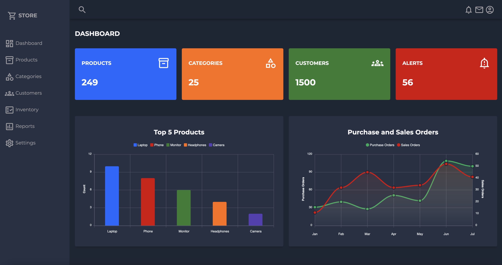

# Sales Insights Web Dashboard



A responsive web application designed to visualize sales data and monitor key business metrics. It enables users to track orders, manage products and categories, analyze customer performance, and gain insights through dynamic charts and summaries.

## Features

### Dashboard Overview
- Displays key metrics including total sales, number of products, categories, clients, and alerts
- Visualizes total sales with real-time, currency-formatted updates

### Sales Tracking
- Lists the latest customer orders with customer names and order values
- Identifies high-value customers based on cumulative purchases

### Product Management
- Enables control and updates of product and category information
- Provides inventory management capabilities

### Data Visualization
- Utilizes bar and area charts to present trends and performance metrics via ApexCharts
- Interactive chart elements for detailed analysis

## Technologies Used

**Frontend:**
- HTML
- CSS
- JavaScript

**Visualization:**
- ApexCharts
  
## Installation and Setup

1. Clone the repository:
   ```bash
   git clone https://github.com/syedmaazsaeed/sales-dashboard.git
2. Navigate to the project directory:
   ```bash
   cd sales-dashboard
3. Open the application in your browser:
   Launch index.html in any modern web browser

## Usage Instructions

1. Navigation:
   - Use the sidebar to access different sections
   - Available sections: Dashboard, Products, Categories, Customers, Inventory, Reports

2. Dashboard Features:
   - View summarized KPIs on the main dashboard
   - Interact with dynamic charts and visualizations
   - Monitor recent orders in the orders section
   - Analyze top customers by purchase value

3. Data Analysis:
   - Examine sales trends using interactive charts
   - Review category performance through breakdowns
   - Track inventory levels and product performance

## License

This project is open-source and available under the MIT License.

## Future Enhancements

- Add deployment instructions for GitHub Pages
- Include additional screenshots of key features
- Expand to full-stack application with backend integration
